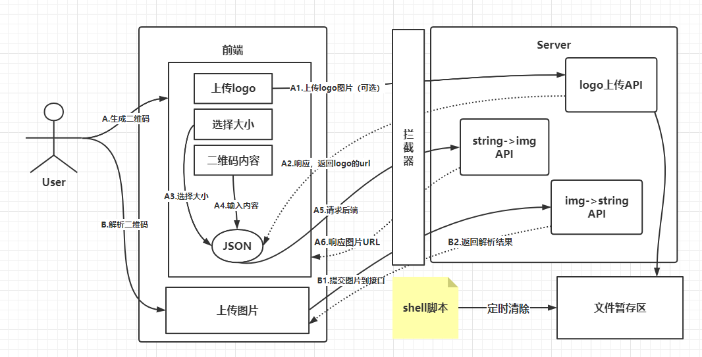

### 0 安装运行步骤

安装：``` git clone https://github.com/ibarryyan/sb_qr_code.git ```

构建：``` mvn install ```

### 1 整体架构



### 2 注意点

- 拦截器：防刷接口
- Shell脚本：定时清除logo图片缓存

### 3 请求样例

#### 1 文字->二维码

上传Logo

```shell
http://${IP}/uploadLogo
```

```json
{
  "file": "Desktop\\QQ图片20220603175226.jpg"
}
```

生成二维码：

```shell
http://${IP}/encodeImg
```

```json
{
  "imgFormat": "jpg",
  "content": "Hello",
  "imgSize": "BIG",
  "logoPath": "Desktop\\312321312asd.jpg"
}
```

- imgFormat：jpg、png、gif
- imgSize：MINI、SMALL、MIDDLE、BIG

#### 2 二维码->文字

```shell
http://${IP}/decodeImg
```

```json
{
  "file": "Desktop\\QQ图片20220603175226.jpg"
}
```

### 4 TODO

- 接口防刷
- 定时清除图片缓冲区